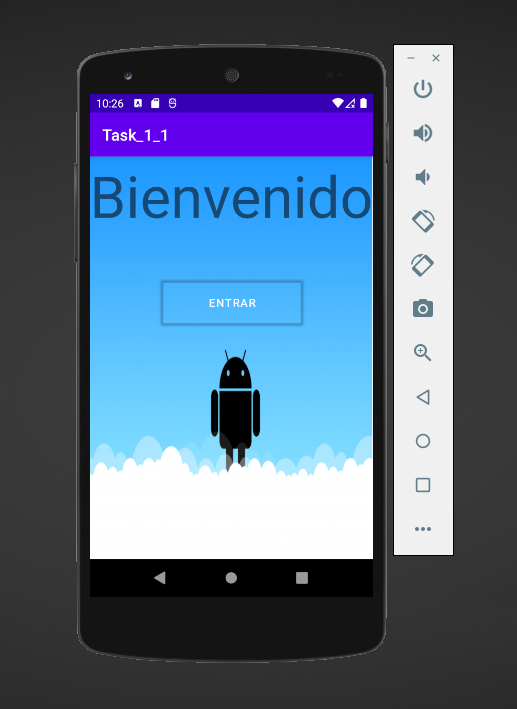
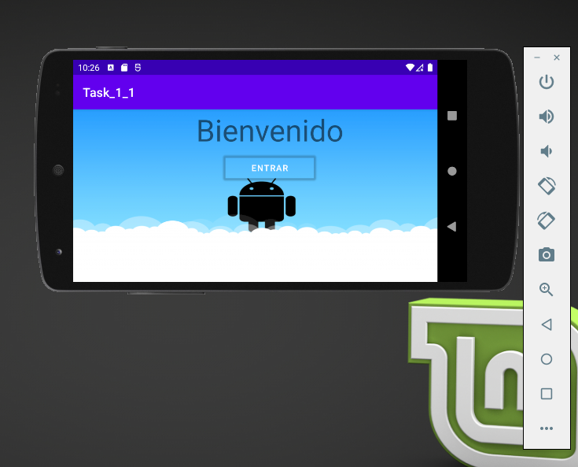
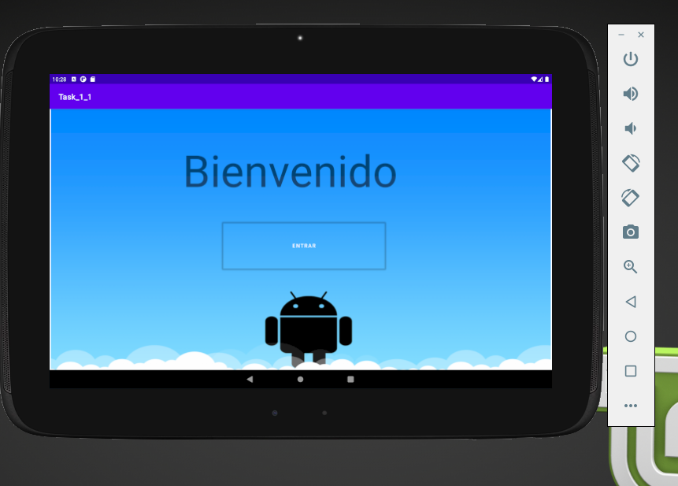
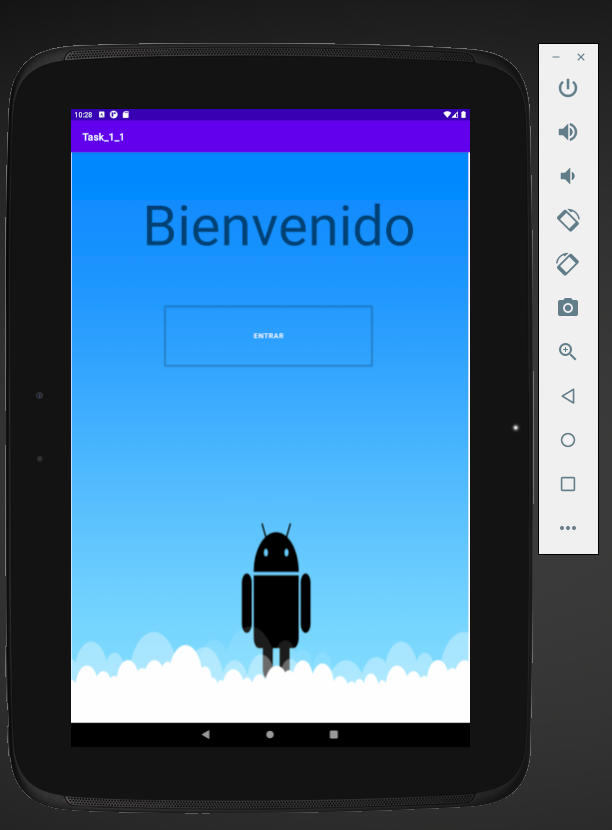
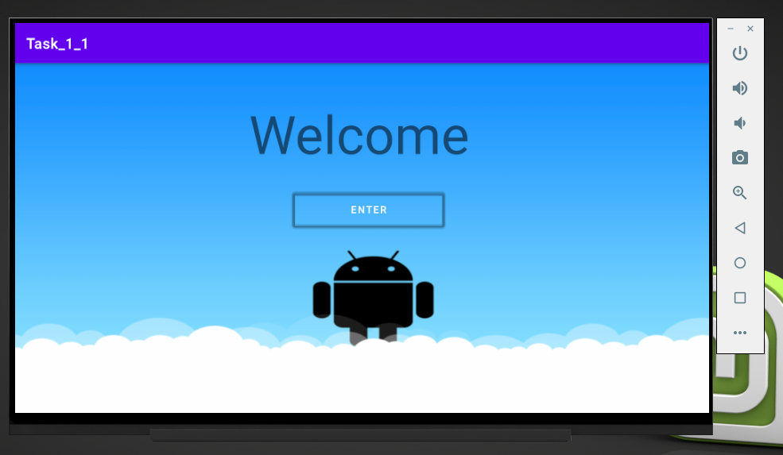

# Mi-primer-proyecto-Android


 Este proyecto tiene la intención de relacionarlo a usted con android-studio, se solicita realizar un proyecto android el cual tenga soporte de idiomas:
a. Español (default)
b. Inglés
c. Francés
d. Alemán

De la misma manera se solicita usar el fondo de pantalla el cual estará definido por una imagen, se solicita generar un archivo nine-patch para que sea redimensionable, de igual forma se solicita tener soporte a multiples pantallas y sus orientaciones
# Resultados 
Siguíendo las indicaciones mencionadas y los conceptos vistos en el curso en la tres primeras semanas, podemos observar los soportes para los siguientes dispositivos.

## Smatphone Android (Android 11.0 google APIs), Resolución (1080 x 1920)
### Orientación Vertical


### Orientación Horizontal

## Tablet Android Nexus 10 (Android 11.0 google APIs), Resolución (2560 x 1600)
### Orientación Horizontal


### Orientación vertical

## TV Android 1080p (Android 10.0 Android Tv), Resolución (1920 x 1080)

# Soporte de idiomas 

Tal como se menciona en la guía es necesario abrir un recurso de soporte de idiomas con archivos .xml en la carpeta de strongs
## Español
```
<resources>
    <string name="app_name">Task_1_1</string>
    <string name="titulo_app">Bienvenido</string>
    <string name="boton_app">Entrar</string>
</resources>
```
## Ingles
```
<?xml version="1.0" encoding="utf-8"?>
<resources>
    <string name="app_name">Task_1_1</string>
    <string name="titulo_app">Welcome</string>
    <string name="boton_app">Enter</string>
</resources>
```
## Francés
```
<?xml version="1.0" encoding="utf-8"?>
<resources>
    <string name="app_name">Task_1_1</string>
    <string name="titulo_app">Bienvenue</string>
    <string name="boton_app">Enter</string>
</resources>
```
## Aleman
```
<?xml version="1.0" encoding="utf-8"?>
<resources>
    <string name="app_name">Task_1_1</string>
    <string name="titulo_app">Willkommen</string>
    <string name="boton_app">Betreten</string>
</resources>
```
# End
